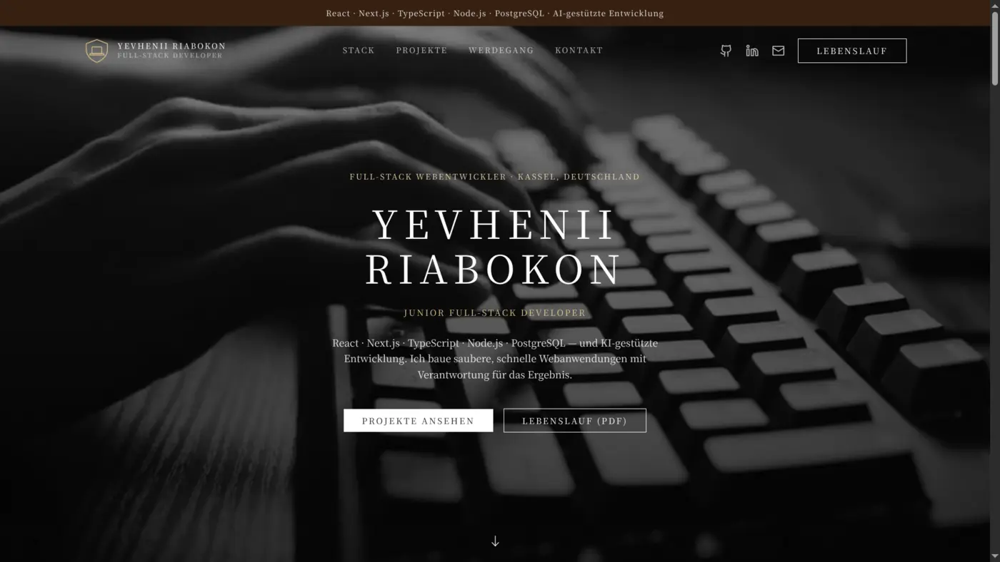
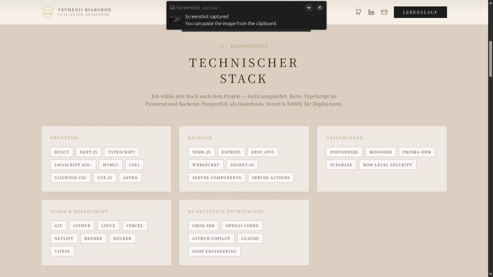
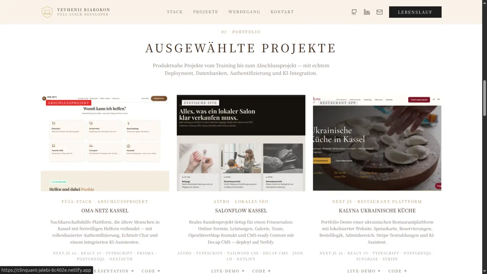
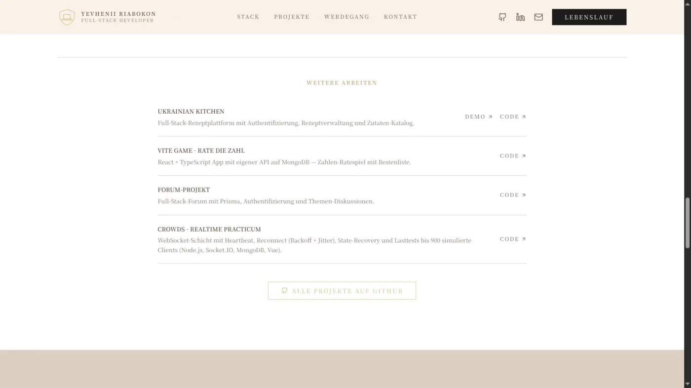
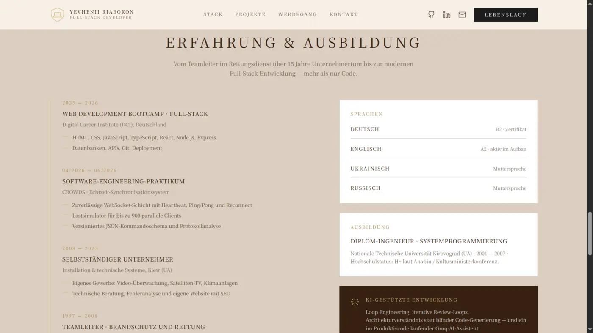
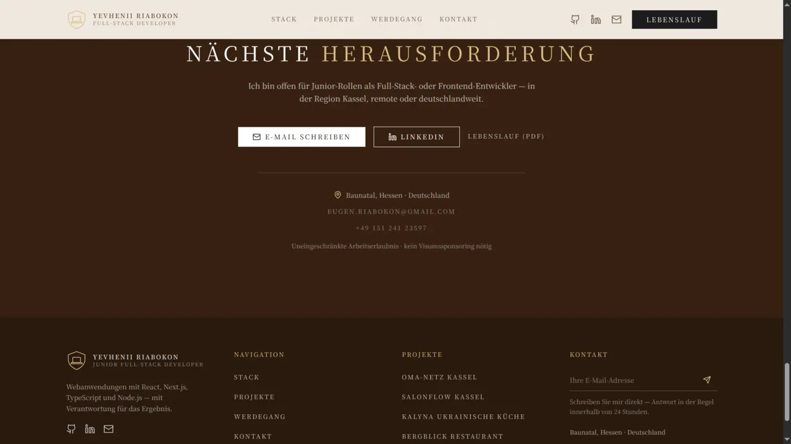

<div align="center">

  # Portfolio - Yevhenii Riabokon

  **Junior Full-Stack Webentwickler - React - Next.js - TypeScript - Node.js**

  [](https://yevhenii-portfolio-navy.vercel.app)
  [](https://github.com/Yevhenii1951/portfolio)
  [](public/cv/Yevhenii_Riabokon_Lebenslauf_Junior_FullStack_DE_ATS.pdf)

  
  
  
  
  
  

</div>

---

<p align="center">
  <a href="#ueberblick">Ueberblick</a> -
  <a href="#features">Features</a> -
  <a href="#screenshots">Screenshots</a> -
  <a href="#tech-stack">Tech Stack</a> -
  <a href="#getting-started">Getting Started</a> -
  <a href="#projektstruktur">Struktur</a>
</p>

---

## Ueberblick

Dieses Repository enthaelt mein persoenliches Entwickler-Portfolio. Die Website
praesentiert meine wichtigsten Full-Stack-Projekte, meinen technischen Stack,
meinen Werdegang und direkte Kontaktmoeglichkeiten in einer ruhigen,
editorialen Oberflaeche.

Der Fokus liegt auf einem professionellen ersten Eindruck fuer Bewerbungen und
Projektgespraeche: klare Projektkarten, echte Live-Demos, GitHub-Links,
Lebenslauf-PDF, responsive Navigation und eine visuelle Gestaltung mit warmer
Creme-, Gold- und Kakao-Palette.

> **Live-Demo:** [yevhenii-portfolio-navy.vercel.app](https://yevhenii-portfolio-navy.vercel.app)

---

## Inhalt

```text
1. Hero mit Video-Hintergrund und klarer Positionierung
2. Stack-Sektion mit Frontend, Backend, Datenbanken, Tools und AI-Workflow
3. Projektbereich mit Live-Demos, Code-Links und Hover-Bildern
4. Werdegang mit Ausbildung, Praktikum und technischer Vorerfahrung
5. Kontaktbereich mit E-Mail, Telefon, LinkedIn, GitHub und Lebenslauf
```

---

## Features

| Bereich | Feature | Beschreibung |
|---------|---------|--------------|
| Einstieg | **Hero-Sektion** | Vollflaechiger Einstieg mit Video-/Poster-Asset, Kurzprofil und direkten Aktionen |
| Portfolio | **Projektkarten** | Ausgewaehlte Projekte mit Beschreibung, Tech-Stack, Live-Demo, GitHub-Link und Bildwechsel |
| Profil | **Skill-Uebersicht** | Gruppierte Technologien fuer Frontend, Backend, Datenbanken, Tools, Deployment und KI-gestuetzte Entwicklung |
| Karriere | **Werdegang** | Kompakte Timeline mit DCI-Bootcamp, Praktikum und frueherer technischer Erfahrung |
| Kontakt | **Direkte Kontaktwege** | E-Mail, Telefon, LinkedIn, GitHub und PDF-Lebenslauf sind schnell erreichbar |
| UX | **Responsive Design** | Optimiert fuer Desktop, Tablet und Smartphone |
| Motion | **Dezente Animationen** | Scroll-Reveals und Bildwechsel mit `motion`, ohne die Inhalte zu ueberladen |
| SEO | **Metadaten** | Deutsche Seitensprache, Open Graph Daten, Keywords und `metadataBase` fuer Deployment |

---

## Screenshots

### Startseite

<table>
  <tr>
    <td></td>
    <td></td>
  </tr>
</table>

### Projekte

<table>
  <tr>
    <td></td>
    <td></td>
  </tr>
</table>

### Werdegang und Kontakt

<table>
  <tr>
    <td></td>
    <td></td>
  </tr>
</table>

---

## Ausgewaehlte Projekte

| Projekt | Typ | Stack | Links |
|---------|-----|-------|-------|
| **OMA-NETZ Kassel** | Abschlussprojekt / Nachbarschaftshilfe | Next.js 16, React 19, TypeScript, Prisma, PostgreSQL, NextAuth, Pusher, Groq AI | [Demo](https://oma-netz-final-project-valerija-yev.vercel.app/landing) - [Code](https://github.com/Yevhenii1951/Oma_netz_final_project_Valerija_Yevhenii) |
| **SalonFlow Kassel** | Lokale Business-Website | Astro, TypeScript, Tailwind CSS, Decap CMS, JSON-LD, Netlify | [Demo](https://clinquant-jalebi-8c402e.netlify.app/) - [Code](https://github.com/Yevhenii1951/SalonFlow-Kassel) |
| **Kalyna Ukrainische Kueche** | Restaurant-Plattform | Next.js 16, React 19, TypeScript, PostgreSQL, Supabase, Stripe | [Demo](https://restourant-ukrainishe-kueche.vercel.app/de) - [Code](https://github.com/Yevhenii1951/Restourant_ukrainishe_kueche) |
| **Bergblick Restaurant** | Full-Stack Restaurant-Site | Astro 5, React 19, Nanostores, Tailwind 4, Vercel Functions, PostgreSQL | [Demo](https://bergblick-restaurant.vercel.app/) - [Code](https://github.com/Yevhenii1951/bergblick-restaurant) |
| **Handwerker-Booking Kassel** | Buchungsplattform | Next.js 16, Supabase, PostgreSQL, Zod, shadcn/ui, Vitest | [Demo](https://handwerker-booking-pro-kassel.vercel.app/) - [Code](https://github.com/Yevhenii1951/handwerker-booking-pro-Kassel) |

---

## Tech Stack

### Frontend

| Technologie | Einsatz |
|-------------|---------|
| **Next.js 16** | App Router, Server Components, statisches Portfolio-Deployment |
| **React 19** | Komponentenbasierte UI |
| **TypeScript 5** | Typsichere Datenstrukturen und Komponenten |
| **Tailwind CSS 4** | Styling, responsive Layouts und Design Tokens |
| **Motion 13** | Scroll-Reveal, Bildwechsel und dezente UI-Animationen |

### Inhalte und Assets

| Bereich | Einsatz |
|---------|---------|
| **`src/lib/data.ts`** | Zentrale Datenquelle fuer Kontakt, Projekte, Skills und Werdegang |
| **WebP-Bilder** | Optimierte Projekt- und README-Screenshots |
| **PDF-CV** | Direkt verlinkter Lebenslauf im Repository |
| **Video-Asset** | Hero-Hintergrund mit Poster-Fallback |

### Entwicklung und Deployment

| Tool | Einsatz |
|------|---------|
| **ESLint 9** | Code-Qualitaet |
| **npm** | Dependency- und Script-Management |
| **Vercel** | Hosting und Deployment |
| **GitHub** | Versionierung und Projektpraesentation |

---

## Getting Started

### Voraussetzungen

- Node.js 20+
- npm

### Installation

```bash
git clone https://github.com/Yevhenii1951/portfolio.git
cd portfolio
npm install
npm run dev
```

Die lokale Entwicklungsumgebung laeuft danach auf
[http://localhost:3000](http://localhost:3000).

### Wichtige Scripts

| Script | Beschreibung |
|--------|--------------|
| `npm run dev` | Startet den lokalen Next.js-Entwicklungsserver |
| `npm run build` | Erstellt den Production-Build |
| `npm run start` | Startet den Production-Server nach einem Build |
| `npm run lint` | Fuehrt ESLint aus |

---

## Projektstruktur

```text
portfolio/
+-- public/
|   +-- cv/                  # Lebenslauf-PDF
|   +-- for_readme/          # Optimierte README-Screenshots
|   +-- img/                 # Projektbilder und Hero-Assets
+-- src/
|   +-- app/                 # Next.js App Router
|   +-- components/site/     # Seitenbereiche und UI-Komponenten
|   +-- lib/data.ts          # Portfolio-Inhalte
+-- next.config.ts
+-- package.json
+-- tsconfig.json
```

---

## Kontakt

| Kanal | Link |
|-------|------|
| E-Mail | [eugen.riabokon@gmail.com](mailto:eugen.riabokon@gmail.com) |
| LinkedIn | [linkedin.com/in/yevhenii-r-5584a83aa](https://www.linkedin.com/in/yevhenii-r-5584a83aa) |
| GitHub | [github.com/Yevhenii1951](https://github.com/Yevhenii1951) |
| Lebenslauf | [PDF ansehen](public/cv/Yevhenii_Riabokon_Lebenslauf_Junior_FullStack_DE_ATS.pdf) |

---

<div align="center">

  **Gebaut mit Next.js, TypeScript und einer ordentlichen Portion Liebe zum Detail.**

</div>
